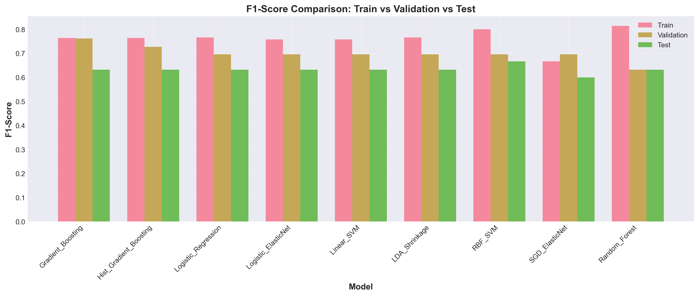
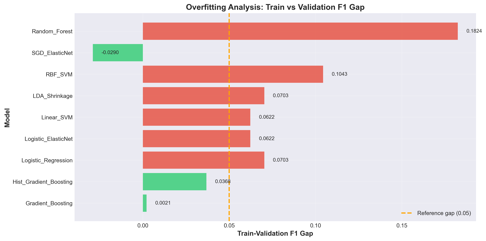
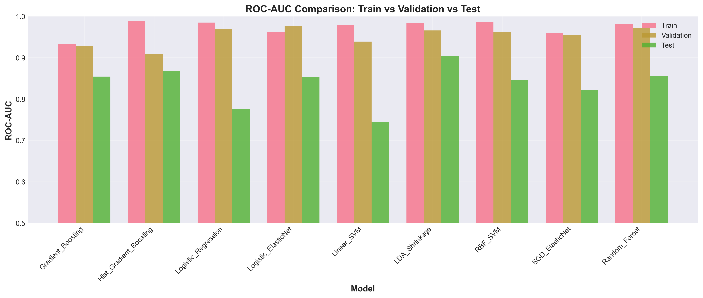
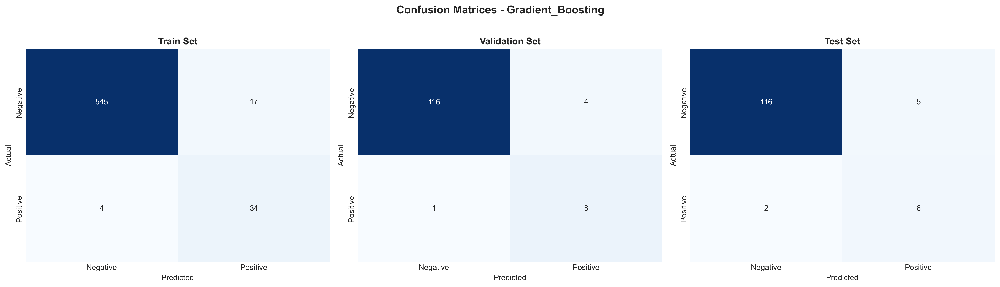

# 🏥 Cervical Cancer Risk Prediction — MLOps Pipeline


An end-to-end MLOps project for cervical cancer risk prediction with **9 supervised
classification algorithms**, leakage-safe hyperparameter tuning, an MLflow Model
Registry, and a FastAPI prediction service.

> **Research use only.** This project is for educational and research purposes. It
> is not a medical device and must not be used to diagnose, screen, or guide
> clinical decisions.

---

## 📁 Project Structure

```
Cervical-Cancer-Prediction/
├── 📓 notebooks/
│   ├── cervical_eda.ipynb                                # Exploratory Data Analysis
│   ├── cervical_02_feature_engineering_advanced.ipynb    # 70/15/15 split (leakage-safe)
│   ├── cervical_03_model_training_advanced.ipynb         # 9 models, GridSearchCV + MLflow
│   ├── cervical_04_mlflow_model_registry.ipynb           # MLflow Model Registry
│   ├── cervical_04_model_evaluation.ipynb                # Evaluation + comparison
│   └── api_01…api_08.ipynb                               # Notebooks that build the API
├── 📊 data/raw/
│   └── kag_risk_factors_cervical_cancer.csv              # Raw dataset (858 rows × 36 cols)
├── 📂 processed_data/                                    # Generated by the pipeline (gitignored)
├── 🤖 models/                                            # 9 tuned *_tuned.pkl + comparison CSV
├── 📈 evaluation_outputs/                                # Plots + comprehensive_comparison.csv
├── 🚀 api/
│   ├── app/
│   │   ├── main.py            # FastAPI app factory (CORS, error handlers, lifespan)
│   │   ├── config.py          # Settings (MLflow URI, model name/stage, feature path)
│   │   ├── model_loader.py    # Registry loading, caching, dynamic model listing
│   │   ├── models.py          # Pydantic schemas (35-field PredictionInput)
│   │   ├── preprocessor.py    # Feature-order alignment (np.nan for missing)
│   │   ├── report_generator.py# Clinical report generation
│   │   ├── templates/risk_report_template.md
│   │   └── routers/           # health.py, predict.py, report.py
│   ├── run.py                 # Start the API server
│   ├── requirements.txt
│   └── demo_prediction.json   # Example 35-feature payload
├── 📝 docs/
│   ├── cervical_PROJECT_SUMMARY.md   # Project overview
│   └── cervical_README.md            # Detailed API guide
├── 🐳 docker/
│   ├── cervical_Dockerfile
│   ├── cervical_docker-compose.yml
│   └── cervical_.dockerignore
└── run_pipeline.py, run_feature_engineering.py   # Scripted pipeline helpers
```

---

## 🔄 Pipeline Workflow

```
cervical_eda → cervical_02_feature_engineering → cervical_03_model_training
             → cervical_04_mlflow_model_registry → cervical_04_model_evaluation
```

| Stage | Notebook | What it produces |
|-------|----------|------------------|
| EDA | `cervical_eda.ipynb` | Distributions, correlations, missing-value report |
| Feature engineering | `cervical_02_...` | 70/15/15 stratified split, `processed_data/*.npy`, `feature_columns.json` |
| Training | `cervical_03_...` | 9 tuned pipelines, MLflow runs, `models/*_tuned.pkl` |
| Registry | `cervical_04_mlflow_model_registry.ipynb` | 9 registered models, best model promoted to Production |
| Evaluation | `cervical_04_model_evaluation.ipynb` | Plots + `evaluation_outputs/comprehensive_comparison.csv` |

> `run_pipeline.py` runs feature engineering → training → registry → evaluation.
> EDA is exploratory and left out of the script.

### Data Split (leakage-safe)

| Dataset | Size | Share | Usage |
|---------|------|-------|-------|
| **Training** | 600 | 70% | Model training; SMOTE fitted inside each CV fold |
| **Validation** | 129 | 15% | Hyperparameter tuning + model selection |
| **Test** | 129 | 15% | Final evaluation only |

**Dataset:** 858 samples × 36 columns (35 features + `Biopsy` target);
`Biopsy` is highly imbalanced (55 positive / 803 negative), which is why SMOTE
and stratified splitting are used.

---

## 🚀 Quick Start

### 1. Run the pipeline

```bash
# From the repository root
cd Cervical-Cancer-Prediction

# Option A — run the notebooks in order
jupyter notebook notebooks/cervical_eda.ipynb
jupyter notebook notebooks/cervical_02_feature_engineering_advanced.ipynb
jupyter notebook notebooks/cervical_03_model_training_advanced.ipynb
jupyter notebook notebooks/cervical_04_mlflow_model_registry.ipynb
jupyter notebook notebooks/cervical_04_model_evaluation.ipynb

# Option B — scripted (feature engineering → training → registry → evaluation)
python run_pipeline.py
```

The pipeline generates `processed_data/`, `models/*_tuned.pkl`, and
`notebooks/mlflow.db`. **These are gitignored, so run the pipeline before
starting the API or building the Docker image.**

### 2. Start the API

```bash
cd api
pip install -r requirements.txt
python run.py
```

### 3. View the MLflow UI

```bash
cd notebooks   # where mlflow.db is generated
mlflow ui --backend-store-uri sqlite:///mlflow.db --port 5000
```

### 4. Access services

- **FastAPI docs:** http://localhost:8000/docs
- **MLflow UI:** http://localhost:5000

---

## 🎯 Model Performance

Ranked by repeated-CV F1 with a train–validation overfitting-gap check
(source: `models/model_comparison_advanced.csv`).

| Model | Train F1 | Val F1 | Test F1 | Train–Val Gap | Verdict |
|-------|----------|--------|---------|---------------|---------|
| **Gradient_Boosting** | 0.7640 | 0.7619 | 0.6316 | 0.0021 | ✅ Recommended |
| Hist_Gradient_Boosting | 0.7640 | 0.7273 | 0.6316 | 0.0368 | ✅ Recommended |
| SGD_ElasticNet | 0.6667 | 0.6957 | 0.6000 | −0.0290 | Within gap (underfit-leaning) |
| Logistic_ElasticNet | 0.7579 | 0.6957 | 0.6316 | 0.0622 | ⚠️ Caution |
| Linear_SVM | 0.7579 | 0.6957 | 0.6316 | 0.0622 | ⚠️ Caution |
| Logistic_Regression | 0.7660 | 0.6957 | 0.6316 | 0.0703 | ⚠️ Caution |
| LDA_Shrinkage | 0.7660 | 0.6957 | 0.6316 | 0.0703 | ⚠️ Caution |
| RBF_SVM | 0.8000 | 0.6957 | 0.6667 | 0.1043 | ⚠️ Highest test F1, most overfit |
| Random_Forest | 0.8140 | 0.6316 | 0.6316 | 0.1824 | ❌ Most overfit |

### Best model: Gradient_Boosting

- **Test F1:** 0.6316 · **Test ROC-AUC:** 0.8543 · **Validation F1:** 0.7619
- **Overfitting gap:** 0.0021 (minimal) · **Test recall:** 0.75 (6 of 8 positives)
- Selected by **validation F1 + overfitting-gap check**; the test set is reported
  for final assessment only.

### Evaluation plots

| F1 comparison | Overfitting analysis |
|---|---|
|  |  |

| ROC-AUC comparison | Confusion matrices (best model) |
|---|---|
|  |  |

---

## 🐳 Docker Deployment

Docker expects the pipeline to have run first (it mounts `notebooks/mlflow.db`
and copies `processed_data/feature_columns.json`).

```bash
cd docker
docker-compose -f cervical_docker-compose.yml up --build
```

This starts the API on port 8000 and the MLflow UI on port 5000.

---

## 📊 Key Features

### ✅ Leakage-safe pipeline
- 70/15/15 stratified split (600 / 129 / 129).
- Imputation, scaling, and **SMOTE are fitted inside each cross-validation fold**,
  never on the full dataset.
- Validation set drives hyperparameter tuning and model selection; the test set is
  used once, for final evaluation.

### ✅ Hyperparameter tuning
- `GridSearchCV` with `RepeatedStratifiedKFold` (5 folds × 3 repeats).
- All 9 algorithms tuned independently, scored on F1.

### ✅ Overfitting detection
- Compares **Train vs Validation** F1 (reference gap 0.05).
- Per-model gap analysis drives the recommendation.

### ✅ Comprehensive evaluation
- Accuracy, precision, recall, F1, ROC-AUC, PR-AUC across train/val/test.
- Plots: F1 comparison, overfitting analysis, ROC-AUC comparison, confusion matrices.

### ✅ MLflow Model Registry
- **Experiment:** `Cervical_Cancer_Model_Training_Leakage_Safe`
- **Backend:** SQLite (`notebooks/mlflow.db`)
- 9 models registered via `mlflow.register_model()` with version history
- Stage management: None → Staging → Production
- **Production model:** `Gradient_Boosting` (the single best model by the shared
  selection rule)
- Registry loading: `models:/Gradient_Boosting/Production`
- Dynamic listing: `MlflowClient().search_registered_models()`

---

## 📖 API

| Endpoint | Method | Description |
|----------|--------|-------------|
| `/` | GET | Service metadata |
| `/health` | GET | Health + loaded-model info |
| `/models` | GET | List registered models |
| `/predict` | POST | Binary risk prediction (`?model=Name` optional) |
| `/predict/report` | POST | Prediction + Markdown clinical report (`?model=Name` optional) |
| `/docs`, `/redoc` | GET | Interactive API docs |

**Request body:** the 35 patient features (`api/demo_prediction.json` is a
complete example). **Response:** `prediction` (0/1), `prediction_label`,
`confidence`, `model_name`, `model_version`, `threshold`.

See [`docs/cervical_README.md`](docs/cervical_README.md) for a full walkthrough.

---

## 🛠️ Technologies

| Component | Technology |
|-----------|-----------|
| Language | Python 3.13 |
| ML | scikit-learn, imbalanced-learn (SMOTE) |
| Tracking / Registry | MLflow 2.22 (SQLite backend) |
| API | FastAPI + Uvicorn + Pydantic v2 |
| Data | pandas, NumPy |
| Viz | Matplotlib, Seaborn |
| Packaging | Docker + Docker Compose |

---

## 📧 Contact

- `docs/cervical_README.md` — detailed API guide
- `docs/cervical_PROJECT_SUMMARY.md` — project overview
- Swagger UI — http://localhost:8000/docs
